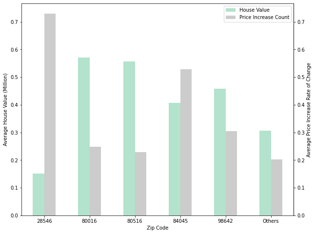
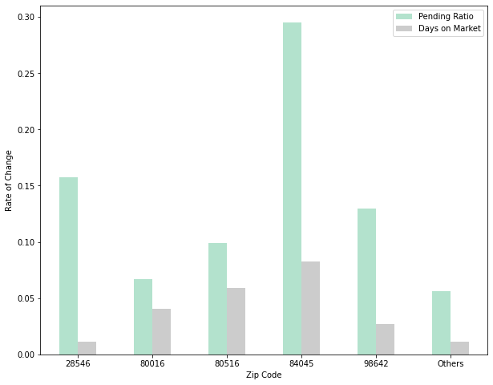
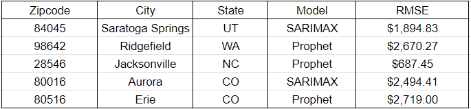

# Phase_4_Project
 
**Authors**: *Nina Vergara, Manav Kahlon, Ben Bowman*
  
## Overview
- [Business Problem](#Business-Problem)
- [Data](#Data)
   - [Zillow and Realtor](./data)
- [Methods](#Methods)
- [EDA Results: Notable Features](#EDA-Results-Notable-Features) 
- [Modeling Results](#Modeling-Results)
- [Conclusions](#Conclusions)
- [For More Information](#For-More-Information)
- [Repository Structure](#Repositroy-Structure)
  

## Business Problem
A real estate investment company has asked us to select the top five US zip codes to invest in.  
 
## Data
We examined more than 30,000 records from Zillow that included house prices across different zip codes from 1997-2021. We found additional data from Realtor.com that was used in the selection of the top 5 zip codes. The Zillow dataset contained 316 columns most of which were different dates from 1996 to 2021 with house prices in that zip code. We compressed the dataset into only 10 columns with the time becoming the index column and the values melting into a single column based on their zip code. To create the dataset used for zip code selection, the Zillow and Realtor.com datasets were merged on zip code and record dates. In order to select the zip codes that would yeild the largest ROI, we considered both market and housing characteristics. 


 #### Data from Zillow
    * new_zillow_data.csv
 #### Data from Realtor 
    * Downloaded from: https://www.realtor.com/research/data/
   
## Methods

### Zip Code Selection

For market evaluation, we considered the average pending ratio and average number of days a listing is on the market for. Pending ratio is the ratio of number of listings pending (listings that have accepted an offer) divided by the total number of active listings for a given month. For listing evaluation, we considered the average house value and the number of listings that underwent a price increase. 

For each of these characteristics, we chose to account for the percent change in these averages from one month to the next. This would allow us to choose zip codes that continuously showed growth in the pending ratio, average house value, and number of listings. We counted against houses that showed monthly growth in the number of days on the market.

We weighted the average of these columns for each zip code with the following equation:

zip code score = 0.4(house value change) + 0.2(pending ratio change) + 0.2(price increase change) - 0.2(days on market change)
We selected the top 5 zipcodes with the highest scores.
    
## EDA Results Notable Features


### House Value and Price Increase Count



4/5 selected zipcodes contain houses with higher values than the other zipcodes combined. Zip code 28546 has homes with lower values, but a very high price increase rate of change. This indicates an 'up and coming' zip code, where the homes have consistently garnered value throughout time. 

### Pending Ratio and Days on Market

 
The average days a property is on the market is not a sufficient indicator of consumer demand, because pending properties, or properties that have accepted offers, are still considered 'on the market'. To judge consumer readiness, we selected zipcodes that outpreformed the other zipcodes for increased the number of pending houses while having comparitavely lower days on market increases. 

 
## Modeling Results
We build multiple time series models ranging from a simple naive model to a Facebook Prophet model. The metric we chose was `RMSE` since we want the lowest error between the actual and predicted price of houses in the five recommended zip codes. For two of the zip codes, we used SARIMAX since it not only produced a low RMSE but was better at capturing recent trends in the data and using those trends to make predictions five years into the future. For the other three zip codes, we used a Facebook Prophet model. This model was able to get the lowest `RMSE` while still capturing the recent trends in the data and making future predictions based on this. Here are the top 5 zip codes along with their `RMSE` values:

  
    
## Conclusions
Using our custom score for determination, we selected five US zip codes for the best real estate investments: 84045 (Saratoga Springs, UT), 98642 (Ridgefield, WA), 28546 (Jacksonville, NC), 80016 (Aurora, CO), and 80516 (Erie, CO).  The current and five-year projected prices and ROI’s are as follows:


For the best projected ROI, we suggest Aurora, CO, with a current median home price of just over $300k and a projected 2026 median price of $439k (for an expected ROI of nearly 45%).  For investors looking for a less capital-intensive opportunity, we suggest Jacksonville, NC, where current average home prices are only around $179k, and expected five-year ROI is almost 27%.

    
    
## For More Information
Please review our full analysis in different notebooks [Aurora, CO](./notebooks/Aurora_CO_80016.ipynb), [Erie, CO](./notebooks/Erie_CO_80516.ipynb), [Jacksonville, NC](./notebooks/Jacksonville_NC_28546.ipynb), [Functions to model](./notebooks/Phase_4_functions.py), [Saratoga Springs, UT](./notebooks/Saratoga_Springs_UT_84045.ipynb), and our [Data Prep Notebook](./notebooks/zip_code_selection_and_one_model.ipynb), or our [Presentation](./Presentation.pdf).    
    
## Repositroy Structure
```
├── data                                  <- Sourced from an external source
├── images                                <- Images that were used in the presentation and notebooks
├── Notebooks                             <- The notebooks that we made
    └── Aurora_CO_80016.ipynb                  <- Data Prep Notebook
    └── Erie_CO_80516.ipynb                    <- Erie, CO, 80516 Notebook
    └── Jacksonville_NC_28546.ipynb            <- Jacksonville, NC, 28546 Notebook
    └── Phase_4_functions.py                   <- Phase 4 functions Notebook
    └── Ridgefield_WA_98642.ipynb              <- Ridgefield, WA, 98642 Notebook
    └── Saratoga_Springs_UT_84045.ipynb        <- Saratoga Springs, UT, 84045
    └── zip_code_selection_and_one_model.ipynb <- Data Prep Notebook
├── gitignore                             <- python files to ignore 
├── Presentation.pdf                      <- PDF of our project presentation  
└── README.md                             <- The README.md
```
